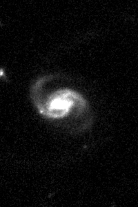

Astrocut Documentation
======================

Introduction
------------

Astrocut contains tools for creating image cutouts from sets images with
shared footprints. This package is under active development, and will
ultimately grow to encompass a range of cutout activities relevant to
images from many missions. Currently there are two modes of interaction:

    - Solving the specific problem of creating image cutouts from sectors of TESS full
      frame images (FFIs) ( `~astrocut.CubeFactory` and `~astrocut.CutoutFactory`)
    - More generalized cutouts from sets of images with the same WCS/pixel scale
      (`~astrocut.fits_cut`)

TESS Full-Frame Image Cutouts
-----------------------------

There are two parts of the package involved in this task, the `~astrocut.CubeFactory`
class allows you to create a large image cube from a list of FFI files.
This is what allows the cutout operation to be performed efficiently.
The `~astrocut.CutoutFactory` class performs the actual cutout and builds
a target pixel file (TPF) that is compatible with TESS pipeline TPFs.

The basic work-flow is to first create an image cube from individual FFI files
(this is one-time work), and then make individual cutout TPFs from this
large cube file. If you are doing a small number of cutouts, it may make
sense for you to use our tesscut web service:
`mast.stsci.edu/tesscut <https://mast.stsci.edu/tesscut/>`_
 
Making image cubes
^^^^^^^^^^^^^^^^^^

Making an image cube is a simple operation, but comes with an important
time/memory trade-off.

.. important::
   **Time/Memory Trade-off**

   The "max_memory" argument determines the maximum memory in GB that will be used
   for the image data cube while it is being built. This is *only* for the data cube,
   and so is somewhat smaller than the amount of memory needed for the program to run.
   Never set it to your systems total memory.

   Because of this, it is possible to build cube files with much less memory than will
   hold the final product. However there is a large time trade-off, as the software must
   run through the list of files multiple times instead of just once. The default value
   of 50 GB was chosen because it comfortably fits a main mission sector of TESS FFIs,
   with the default setting on a system with 65 GB of memory it takes about 15 min to
   build a cube file. On a system with less memory that requires 3 passes through the
   list of files this time rises to ~45 min. 
   

By default ``make_cube`` runs in verbose mode and prints out its progress, however setting
verbose to false will silence all output.

.. code-block:: python

                >>> from astrocut import CubeFactory
                >>> from glob import glob
                >>> from astropy.io import fits
                >>> 
                >>> my_cuber = CubeFactory()
                >>> input_files = glob("data/*ffic.fits") 
                >>> 
                >>> cube_file = my_cuber.make_cube(input_files) #doctest: +SKIP
                Completed file 0
                Completed file 1
                Completed file 2
                .
                .
                .
                Completed file 142
                Completed file 143
                Total time elapsed: 46.42 sec
                File write time: 8.82 sec

                >>> print(cube_file) #doctest: +SKIP
                img-cube.fits

                >>> cube_hdu = fits.open(cube_file) #doctest: +SKIP
                >>> cube_hdu.info()  #doctest: +SKIP
                Filename: img-cube.fits
                No.    Name      Ver    Type      Cards   Dimensions   Format
                0  PRIMARY       1 PrimaryHDU      28   ()      
                1                1 ImageHDU         9   (2, 144, 2136, 2078)   float32   
                2                1 BinTableHDU    302   144R x 147C   [24A, J, J, J, J, J, J, D, 24A, J, 24A, 24A, J, J, D, 24A, 24A, 24A, J, D, 24A, D, D, D, D, 24A, 24A, D, D, D, D, D, 24A, D, D, D, D, J, D, D, D, D, D, D, D, D, D, D, D, D, J, J, D, J, J, J, J, J, J, J, J, J, J, D, J, J, J, J, J, J, D, J, J, J, J, J, J, D, J, J, J, J, J, J, D, J, J, J, J, J, J, J, J, 24A, D, J, 24A, 24A, D, D, D, D, D, D, D, D, J, J, D, D, D, D, D, D, J, J, D, D, D, D, D, D, D, D, D, D, D, D, 24A, J, 24A, 24A, J, J, D, 24A, 24A, J, J, D, D, D, D, J, 24A, 24A, 24A]  

Making cutout target pixel files
^^^^^^^^^^^^^^^^^^^^^^^^^^^^^^^^

To make a cutout, you must already have an image cube to cut out from.
Assuming that that step has been completed, you simply give the central
coordinate and cutout size (in either pixels or angular `~astropy.Quantity`)
to the *cube_cut* function.

You can either specify a target pixel file name, or it will be built as:
"<cube_file_base>_<ra>_<dec>_<cutout_size>_astrocut.fits". You can optionally
also specify a output path, the directory in which the target pixel file will
be saved, if unspecified it defaults to the current directory.

.. code-block:: python

                >>> from astrocut import CutoutFactory
                >>> from astropy.io import fits
                >>> 
                >>> my_cutter = CutoutFactory()
                >>> cube_file = "img-cube.fits"
                >>> 
                >>> cutout_file = my_cutter.cube_cut(cube_file, "251.51 32.36", 5, verbose=True) #doctest: +SKIP
                Cutout center coordinate: 251.51,32.36
                xmin,xmax: [26 31]
                ymin,ymax: [149 154]
                Image cutout cube shape: (144, 5, 5)
                Uncertainty cutout cube shape: (144, 5, 5)
                Target pixel file: img_251.51_32.36_5x5_astrocut.fits
                Write time: 0.016 sec
                Total time: 0.18 sec

                >>> cutout_hdu = fits.open(cutout_file) #doctest: +SKIP
                >>> cutout_hdu.info() #doctest: +SKIP
                Filename: img_251.51_32.36_5x5_astrocut.fits
                No.    Name      Ver    Type      Cards   Dimensions   Format
                0  PRIMARY       1 PrimaryHDU      42   ()      
                1  PIXELS        1 BinTableHDU    222   144R x 12C   [D, E, J, 25J, 25E, 25E, 25E, 25E, J, E, E, 38A]   
                2  APERTURE      1 ImageHDU        45   (5, 5)   float64  

**Note:** The 'TIME' column of the cutout table is formed by taking the average of the TSTART, TSTOP values from the corresponding FFI for each row.
   
A note about the cutout WCS object
""""""""""""""""""""""""""""""""""

TESS FFIs are large and therefore are described by WCS objects that have many non-linear terms. Astrocut creates a new simpler (linear) WCS object from the matched set of cutout pixel coordinates and sky coordinates (from the FFI WCS). This linear WCS object will generally work very well, however at larger cutout sizes (100-200 pixels per side and above) the linear WCS fit will start to be noticeably incorrect at the edges of the cutout.  Three header keywords have been added to the PIXELS extension to give additional information about the cutout WCS:

* **WCS_FFI:** The name of the FFI file used to build the original WCS from which the cutout and cutout WCS were calculated.
* **WCS_MSEP:** The maximum separation in degrees between the cutout's linear WCS and the FFI's full WCS.
* **WCS_SIG:** The error in the cutout's linear WCS, calculated as sqrt((dist(Po_ij, Pl_ij)^2) where dist(Po_ij, Pl_ij) is the angular distance in degrees between the sky position of of pixel i,j in the original full WCS and the new linear WCS.

General fits image cutouts (beta!)\*
-------------------------------------

These functions provide general purpose fits cutout functionality, returning the results either
as fits cutout files, or as images (jpg or png).
An image normalization (`~astrocut.normalize_img`) function is also available.

The function `~astrocut.fits_cut` takes one or more fits files and performs the same cutout in each,
returning the result either in a single fits file or as one fits file per cutout.
It is important to remember that while the expectation is that all input image are
aligned and have the same pixel scale, no checking is done.

.. code-block:: python

                >>> from astrocut import fits_cut
                >>> from astropy.io import fits
                >>> from astropy.coordinates import SkyCoord
                
                >>> input_files = ["https://archive.stsci.edu/pub/hlsp/candels/cosmos/cos-tot/v1.0/hlsp_candels_hst_acs_cos-tot-sect23_f606w_v1.0_drz.fits",
                ...                "https://archive.stsci.edu/pub/hlsp/candels/cosmos/cos-tot/v1.0/hlsp_candels_hst_acs_cos-tot-sect23_f814w_v1.0_drz.fits"]

                >>> center_coord = SkyCoord("150.0945 2.38681", unit='deg')
                >>> cutout_size = [200,300]
                
                >>> cutout_file = fits_cut(input_files, center_coord, cutout_size, drop_after="", single_outfile=True)  #doctest: +SKIP
                >>> print(cutout_file)    #doctest: +SKIP
                ./cutout_150.094500_2.386810_200-x-300_astrocut.fits

                >>> cutout_hdulist = fits.open(cutout_file)  #doctest: +SKIP
                >>> cutout_hdulist.info() #doctest: +SKIP
                Filename: ./cutout_150.094500_2.386810_200-x-300_astrocut.fits
                No.    Name      Ver    Type      Cards   Dimensions   Format
                  0  PRIMARY       1 PrimaryHDU      11   ()      
                  1  CUTOUT        1 ImageHDU        44   (200, 300)   float32   
                  2  CUTOUT        1 ImageHDU        44   (200, 300)   float32   

The function `~astrocut.img_cut` takes one or more fits files and performs the same cutout in each,
returning the result either an image (jpg or png) per cutout, or a single color image.
It is important to remember that while the expectation is that all input images are
aligned and have the same pixel scale, no checking is done.

.. code-block:: python

                >>> from astrocut import img_cut
                >>> from astropy.coordinates import SkyCoord
                >>> from PIL import Image
                
                >>> input_files = ["https://archive.stsci.edu/pub/hlsp/candels/cosmos/cos-tot/v1.0/hlsp_candels_hst_acs_cos-tot-sect23_f606w_v1.0_drz.fits",
                ...                "https://archive.stsci.edu/pub/hlsp/candels/cosmos/cos-tot/v1.0/hlsp_candels_hst_acs_cos-tot-sect23_f814w_v1.0_drz.fits"]

                >>> center_coord = SkyCoord("150.0945 2.38681", unit='deg')
                >>> cutout_size = [200,300]
                
                >>> png_files = img_cut(input_files, center_coord, cutout_size, img_format='png', drop_after="")    #doctest: +SKIP
                >>> print(png_files[0])    #doctest: +SKIP
                ./hlsp_candels_hst_acs_cos-tot-sect23_f606w_v1.0_drz_150.094500_2.386810_200-x-300_astrocut.png

                >>> Image.open(png_files[1]) #doctest: +SKIP
                

Color images can also be produced using `~astrocut.img_cut` given three input files, which will be
treated as the R, G, and B channels respectively.

.. code-block:: python

                >>> from astrocut import img_cut
                >>> from astropy.coordinates import SkyCoord
                >>> from PIL import Image
                
                >>> input_files = ["https://archive.stsci.edu/pub/hlsp/goods/v2/h_nz_sect14_v2.0_drz_img.fits",
                ...                "https://archive.stsci.edu/pub/hlsp/goods/v2/h_ni_sect14_v2.0_drz_img.fits",
                ...                "https://archive.stsci.edu/pub/hlsp/goods/v2/h_nv_sect14_v2.0_drz_img.fits"]
                
                >>> center_coord = SkyCoord("189.51522 62.2865221", unit='deg')
                >>> cutout_size = [200,300]
                
                >>> color_image = img_cut(input_files, center_coord, cutout_size, colorize=True)   #doctest: +SKIP
                >>> print(color_image)    #doctest: +SKIP
                ./cutout_189.515220_62.286522_200-x-300_astrocut.jpg
                
                >>> Image.open(color_image) #doctest: +SKIP
                
.. image:: imgs/color_ex_cutout.png
           
|

\* This is the newest functionality and as such should be considered to be in beta. It has been tested primarily on Hubble deep field drizzled images. We welcome issues and pull-requests to make it more widely functional.

  
.. automodapi:: astrocut
    :skip: test
    :skip: UnsupportedPythonError
    :no-inheritance-diagram:
