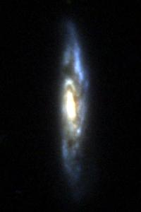
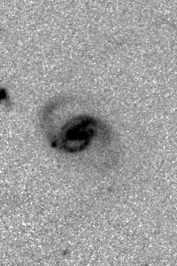

**********************
Astrocut Documentation
**********************

Astrocut is a powerful Python package for generating cutouts from sets of astronomical images with overlapping footprints.

It supports both two-dimensional images and three-dimensional image cubes, making it versatile for a wide range of astronomical data. 
Astrocut is compatible with multiple file formats, including FITS, ASDF, and TESS full-frame images. Beyond cutout extraction, the package 
includes features for post-processing, such as aligning cutouts along a path and combining multiple cutouts for enhanced analysis.

Astrocut is actively maintained and continuously evolving to support the needs of the astronomical community.

Image Cutouts
=============

Astrocut can generate cutouts of image data from FITS and ASDF files using the `~astrocut.FITSCutout` and `~astrocut.ASDFCutout` classes, respectively. 
The package supports both single and multiple cutouts, allowing users to extract data from a single image or multiple images with overlapping footprints.

Both image cutout classes take the following parameters:

- ``input_files``: A list of input image files in the expected format. These can be local file paths, URLs, or S3 URIs.
- ``coordinates``: The coordinates at the center of the cutout.
- ``cutout_size``: The size of the cutout in pixels or angular units.
- ``fill_value``: If the cutout footprint falls outside of the image, this value will be used to fill the missing pixels.

FITS Cutouts
------------

The Flexible Image Transport System (FITS) is a standard format for astronomical data. Astrocut can generate cutouts from FITS files
and return the results in memory or as a written file, depending on the user's preference. The cutout '~astropy.fits.io.HDUList' object 
format is described in the `Astrocut File Fomats <file_formats.html#fits-cutout-files>`__ page.

To make a cutout from a FITS file or files, use the `~astrocut.FITSCutout` class. 

.. code-block:: python

  >>> from astrocut import FITSCutout
  >>> from astropy.coordinates import SkyCoord

  >>> input_files = ["https://archive.stsci.edu/pub/hlsp/candels/cosmos/cos-tot/v1.0/hlsp_candels_hst_acs_cos-tot-sect23_f606w_v1.0_drz.fits",
  ...                "https://archive.stsci.edu/pub/hlsp/candels/cosmos/cos-tot/v1.0/hlsp_candels_hst_acs_cos-tot-sect23_f814w_v1.0_drz.fits"]

  >>> center_coord = SkyCoord("150.0945 2.38681", unit="deg")
  >>> cutout_size = [200, 300]
  >>> fits_cutout = FITSCutout(input_files=input_files, 
  ...                          coordinates=center_coord, 
  ...                          cutout_size=cutout_size, 
  ...                          single_outfile=True)

The resulting `~astrocut.FITSCutout` object can be used to access the cutout data and metadata. The ``cutouts_by_file`` attribute is a dictionary that
stores the individual cutouts as a list of `~astrocut.FITSCutout.CutoutInstance` objects by input filename. The `~astrocut.FITSCutout.CutoutInstance`
object contains the cutout data, shape, world coordinate system (WCS) and other helpful properties.

The ``hdu_cutouts_by_file`` attribute is a dictionary that stores the cutouts as a list of `~astropy.io.fits.ImageHDU` objects by input filename.
These objects can be used to access cutout data and metadata in the HDU header.

The ``fits_cutouts`` attribute is a list of cutouts as `~astropy.io.fits.HDUList` objects. The ``single_outfile`` parameter decides whether all the cutouts
will be written to a single `~astropy.io.fits.HDUList` object or to separate objects. When ``single_outfile`` is set to True,
a single `~astropy.io.fits.HDUList` object will contain all the cutouts. 

.. code-block:: python

  >>> cutout = fits_cutout.fits_cutouts[0]
  >>> cutout.info()
  Filename: (No file associated with this HDUList)
  No.    Name      Ver    Type      Cards   Dimensions   Format
    0  PRIMARY       1 PrimaryHDU       9   ()      
    1  CUTOUT        1 ImageHDU      2767   (200, 300)   float32   
    2  CUTOUT        1 ImageHDU      3343   (200, 300)   float32   

To write the cutouts and their metadata to FITS files, use the `~astrocut.FITSCutout.write_as_fits` method. This method returns a list of paths to the
cutout FITS files. 

.. code-block:: python

  >>> from astropy.io import fits

  >>> path = fits_cutout.write_as_fits()
  >>> print(path)
  ['cutout_150.0945000_2.3868100_200-x-300_astrocut.fits']

  >>> with fits.open(path[0]) as hdul:
  ...     hdul.info()
  Filename: cutout_150.0945000_2.3868100_200-x-300_astrocut.fits
  No.    Name      Ver    Type      Cards   Dimensions   Format
    0  PRIMARY       1 PrimaryHDU      11   ()      
    1  CUTOUT        1 ImageHDU      2769   (200, 300)   float32   
    2  CUTOUT        1 ImageHDU      3345   (200, 300)   float32

By default, the cutouts are written to the current working directory. You can specify a different output directory using the ``output_dir`` parameter.
You can also set the prefix of the cutout file paths using the ``cutout_prefix`` parameter. The default value is "cutout".

ASDF Cutouts
------------

The Advanced Scientific Data Format (ASDF) is a flexible format for storing scientific data. Astrocut can generate cutouts from ASDF files
and return the results in memory or as a written file, depending on the user's preference. The cutout ASDF file format is 
described in the `Astrocut File Formats <file_formats.html#asdf-cutout-files>`__ page.

To make a cutout from an ASDF file or files, use the `~astrocut.ASDFCutout` class.

.. code-block:: python

  >>> from astrocut import ASDFCutout
  >>> from astropy.coordinates import SkyCoord

  >>> input_files = [""]  # Path(s) to local ASDF file, URL, or S3 URI

  >>> center_coord = SkyCoord("80.15189743 29.74561219", unit="deg")
  >>> cutout_size = 25
  >>> asdf_cutout = ASDFCutout(input_files=input_files, 
  ...                          coordinates=center_coord, 
  ...                          cutout_size=cutout_size) #doctest: +SKIP

.. warning::
  Due to the symmetry of the pixel grid, odd values for ``cutout_size`` generally produce
  cutouts that are more accurately centered on the target coordinates than even values
  for ``cutout_size``.

The resulting `~astrocut.ASDFCutout` object can be used to access the cutout data and metadata. The ``cutouts_by_file`` attribute is a dictionary that
stores the individual cutouts as a list of `~astropy.nddata.Cutout2D` objects by input filename. The `~astropy.nddata.Cutout2D`
object contains the cutout data, shape, world coordinate system (WCS) and other helpful properties. The ``cutouts`` attribute is a list of
cutouts as `~astropy.nddata.Cutout2D` objects, one for each input file.

The ``asdf_cutouts`` attribute is a list of cutouts as `~asdf.AsdfFile` objects, and the ``fits_cutout`` attribute is a list of cutouts as
`~astropy.io.fits.HDUList` objects. The cutout objects in these lists can be used to access cutout data and metadata, as shown below.

.. code-block:: python

  >>> cutout_asdf = asdf_cutout.asdf_cutouts[0] #doctest: +SKIP
  >>> cutout_asdf.info() #doctest: +SKIP
  root (AsdfObject)
  └─roman (dict)
    ├─meta (dict)
    │ └─wcs (WCS)
    └─data (ndarray): shape=(25, 25), dtype=float32

  >>> cutout_fits = asdf_cutout.fits_cutouts[0] #doctest: +SKIP
  >>> cutout_fits.info() #doctest: +SKIP
  Filename: (No file associated with this HDUList)
  No.    Name      Ver    Type      Cards   Dimensions   Format
    0  PRIMARY       1 PrimaryHDU      25   (25, 25)   float32  

To write the cutouts and their metadata to ASDF files, use the `~astrocut.ASDFCutout.write_as_asdf` method. This method returns a list of paths to the
cutout ASDF files. 

.. code-block:: python

  >>> import asdf

  >>> path = asdf_cutout.write_as_asdf() #doctest: +SKIP

  >>> with asdf.open(path[0]) as af:
  ...     print(af['roman']['data'].shape) #doctest: +SKIP
  (25, 25)

To write the cutouts and their metadata to FITS files, use the `~astrocut.ASDFCutout.write_as_fits` method. This method returns a list of paths to the
cutout FITS files.

.. code-block:: python

  >>> from astropy.io import fits

  >>> path = asdf_cutout.write_as_fits() #doctest: +SKIP

  >>> with fits.open(path[0]) as hdul:
  ...     hdul.info() #doctest: +SKIP
  Filename: r0099101001001001001_F158_visit_r274dp63x31y81_i2d_269.6970000_66.0450000_25-x-25_astrocut.fits
  No.    Name      Ver    Type      Cards   Dimensions   Format
    0  PRIMARY       1 PrimaryHDU      27   (25, 25)   float32  

By default, the cutouts are written to the current working directory. You can specify a different output directory using the ``output_dir`` parameter
in either of the write functions.

Image Outputs
-------------

Both the `~astrocut.FITSCutout` and `~astrocut.ASDFCutout` classes provide methods to normalize the cutout data and write it as an image, 
either as a a `~PIL.Image.Image` object or a file.

To create cutouts as `~PIL.Image.Image` objects, use the `~astrocut.FITSCutout.get_image_cutouts` method. You can provide the following 
normalization parameters:

- ``stretch``: The stretch function to apply to the image array. Options include "asinh", "sinh", "sqrt", "log", and "linear".
- ``minmax_percent``: Defines an interval for scaling the image based on percentiles. The format is [lower percentile, upper percentile],
  where pixel values outside this range are clipped. Only one of ``minmax_percent`` and ``minmax_value`` should be specified.
- ``minmax_value``: Defines an interval for scaling the image based on values. The format is [min value, max value], where pixel values
  outside this range are clipped. Only one of ``minmax_percent`` and ``minmax_value`` should be specified.
- ``invert``: A boolean value that determines whether the image should be inverted.

.. code-block:: python

  >>> fits_img = fits_cutout.get_image_cutouts(stretch='linear', minmax_percent=[10, 99])[1]
  >>> print(fits_img.size)
  (200, 300)
  >>> fits_img.show() #doctest: +SKIP

To produce a colorized RGB image, set the ``colorize`` parameter to True. Color images require three cutouts, 
which will be treated as the R, G, and B channels, respectively.

.. code-block:: python

  >>> from astrocut import FITSCutout
  >>> from astropy.coordinates import SkyCoord
  
  >>> input_files = ["https://archive.stsci.edu/pub/hlsp/goods/v2/h_nz_sect14_v2.0_drz_img.fits",
  ...                "https://archive.stsci.edu/pub/hlsp/goods/v2/h_ni_sect14_v2.0_drz_img.fits",
  ...                "https://archive.stsci.edu/pub/hlsp/goods/v2/h_nv_sect14_v2.0_drz_img.fits"]
  
  >>> center_coord = SkyCoord("189.51522 62.2865221", unit='deg')
  >>> cutout_size = [200, 300]

  >>> color_image = FITSCutout(input_files, center_coord, cutout_size).get_image_cutouts(colorize=True)[0]
  >>> color_image.show() #doctest: +SKIP
                

To write the cutouts to image files, use the `astrocut.FITSCutout.write_as_img` method. This method returns a list of paths to 
the cutout image files. `astrocut.FITSCutout.write_as_img` takes the same normalization parameters as `astrocut.FITSCutout.get_image_cutouts`.

To specify the output format of the cutout images, use the ``output_format`` parameter.

.. code-block:: python

  >>> from PIL import Image

  >>> path = fits_cutout.write_as_img(stretch='sqrt', invert=True, output_format='png')
  >>> im = Image.open(path[0]) #doctest: +SKIP
  

By default, the cutouts are written to the current working directory. You can specify a different output directory using the ``output_dir`` parameter.
You can also set the prefix of the cutout file paths using the ``cutout_prefix`` parameter. The default value is "cutout".

Cube Cutouts
============

Astrocut enables the creation of cutouts from image cube files, including TESS full-frame images (FFIs).

To begin, the `~astrocut.CubeFactory`` class (for SPOC products) or the `~astrocut.TicaCubeFactory`` class (for TICA FFIs) 
constructs a large image cube from a list of FFI files, optimizing the writing process for efficiency.
The `~astrocut.TessCubeCutout` class then extracts the desired cutout and generates a target pixel file (TPF)
similar to those produced by the TESS Mission.

For a small number of cutouts, the `TESSCut web service <mast.stsci.edu/tesscut <https://mast.stsci.edu/tesscut/>_` may suit 
your needs.

Making Image Cubes
------------------

.. important::
   **Time-Memory Trade-off**

   Making an image cube is a simple operation, but comes with an important
   time-memory trade-off.

   The ``max_memory`` argument determines the maximum memory in GB that will be used
   for the image data cube while it is being built. This is the amount of memory required 
   *only* for the data cube, so is somewhat smaller than the total amount of memory needed
   for the program to run. You should never set it to your system's total memory.

   Because of this, cube files do not need to allocate their total size in
   memory all at once. Instead, a smaller memory allocation can be used while
   the cube file is constructed; however, this will significantly increase the
   execution time as bytes are swapped into and out of the memory allocation 
   being used. The default value of 50 GB was chosen because it fits all of the
   TESS FFIs from a single Prime Mission Sector (Sectors 1-26); however, in the
   current TESS Extended Mission 2, where 6 times more FFIs are observed per Sector
   (compared to the number of FFIs observed per Sector in the Prime Mission), 50 GB
   is not enough space to hold all of the FFIs in memory, and the cubes will be 
   written in multiple blocks. With the default settings, on a system with 64 GB of
   memory, it takes about 3 hours to build a single cube file. On a system with less
   memory or where ``max_memory`` is set to a value less than 50 GB, more passes 
   through the list of files are required, and the time to create a cube can increase
   significantly.
   

Assuming that you have set of calibrated TESS (or TICA) FFI files stored locally, you can
create a cube using the `~astrocut.CubeFactory.make_cube` method (or 
`~astrocut.TicaCubeFactory.make_cube` for TICA products). By default, both `~astrocut.CubeFactory.make_cube` 
and `~astrocut.TicaCubeFactory.make_cube` run in verbose mode and print out progress; setting `verbose` to false will silence
all output.

Note, you can only make cubes from a set of FFIs with the same product type (i.e., only SPOC *or* 
only TICA products) that were observed in the same sector, camera, and CCD.

The output image cube file format is described in the `Astrocut File Formats <file_formats.html#cube-files>`__ page.

.. code-block:: python

  >>> from astrocut import CubeFactory
  >>> from glob import glob
  >>> from astropy.io import fits
  
  >>> my_cuber = CubeFactory()
  >>> input_files = glob("data/*ffic.fits") 
  
  >>> cube_file = my_cuber.make_cube(input_files) #doctest: +SKIP
  Completed file 0
  Completed file 1
  Completed file 2
  .
  .
  .
  Completed file 142
  Completed file 143
  Total time elapsed: 46.42 sec
  File write time: 8.82 sec

  >>> print(cube_file) #doctest: +SKIP
  img-cube.fits

  >>> cube_hdu = fits.open(cube_file) #doctest: +SKIP
  >>> cube_hdu.info()  #doctest: +SKIP
  Filename: img-cube.fits
  No.    Name      Ver    Type      Cards   Dimensions   Format
  0  PRIMARY       1 PrimaryHDU      28   ()      
  1                1 ImageHDU         9   (2, 144, 2136, 2078)   float32   
  2                1 BinTableHDU    302   144R x 147C   [24A, J, J, J, J, J, J, D, 24A, J, 24A, 24A, J, J, D, 24A, 24A, 24A, J, D, 24A, D, D, D, D, 24A, 24A, D, D, D, D, D, 24A, D, D, D, D, J, D, D, D, D, D, D, D, D, D, D, D, D, J, J, D, J, J, J, J, J, J, J, J, J, J, D, J, J, J, J, J, J, D, J, J, J, J, J, J, D, J, J, J, J, J, J, D, J, J, J, J, J, J, J, J, 24A, D, J, 24A, 24A, D, D, D, D, D, D, D, D, J, J, D, D, D, D, D, D, J, J, D, D, D, D, D, D, D, D, D, D, D, D, 24A, J, 24A, 24A, J, J, D, 24A, 24A, J, J, D, D, D, D, J, 24A, 24A, 24A]  

Making Cutout Target Pixel Files
--------------------------------

Astrocut can generate cutout target pixel files from TESS cubes using the `astrocut.TessCubeCutout` class and return the results
in memory or as a file, depending on the user's preference. The cutout target pixel file format is described in the 
`Astrocut File Formats <file_formats.html#target-pixel-files>`__ page.

The `astrocut.TessCubeCutout` class takes the following parameters:

- ``input_files``: A list of input cube files in the expected format. These can be local file paths, URLs, or S3 URIs.
- ``coordinates``: The coordinates at the center of the cutout.
- ``cutout_size``: The size of the cutout in pixels or angular units.
- ``fill_value``: If the cutout footprint falls outside of the image, this value will be used to fill the missing pixels.
- ``product``: The type of TESS product to use. Options are "SPOC" or "TICA". Default is "SPOC".

.. code-block:: python

  >>> from astrocut import TessCubeCutout
  >>> from astropy.io import fits

  >>> cube_file = "img-cube.fits"
  >>> cube_cutout = TessCubeCutout(cube_file,
  ...                              coordinates="251.51 32.36",
  ...                              cutout_size=5)  #doctest: +SKIP

The resulting `~astrocut.TessCubeCutout` object can be used to access the cutout data and metadata. The ``cutouts_by_file`` attribute
is a dictionary that stores the individual cutouts as a list of `~astrocut.TessCubeCutout.CubeCutoutInstance` objects by input filename.
The `~astrocut.TessCubeCutout.CubeCutoutInstance` object contains the cutout data, shape, world coordinate system (WCS), and other helpful properties.

The ``tpf_cutouts_by_file`` attribute is a dictionary that stores the cutouts as a list of `~astropy.io.fits.HDUList` objects by input filename.
These objects are in the format of target pixel files and can be used to access cutout data and metadata in the HDU header.
The ``tpf_cutouts`` attribute is a list of cutouts as `~astropy.io.fits.HDUList` objects in the format of target pixel files.

.. code-block:: python

  >>> tpf_cutout = cube_cutout.tpf_cutouts[0] #doctest: +SKIP
  >>> tpf_cutout.info() #doctest: +SKIP
  Filename: (No file associated with this HDUList)
  No.    Name      Ver    Type      Cards   Dimensions   Format
  0  PRIMARY       1 PrimaryHDU      42   ()      
  1  PIXELS        1 BinTableHDU    222   144R x 12C   [D, E, J, 25J, 25E, 25E, 25E, 25E, J, E, E, 38A]   
  2  APERTURE      1 ImageHDU        45   (5, 5)   float64  

To write the cutout target pixel files to FITS files, use the `~astrocut.TessCubeCutout.write_as_tpf` method. 
This method returns a list of paths to the cutout TPF files. The file names will be in the pattern of 
"<cube_file_base>_<ra>_<dec>_<cutout_size>_astrocut.fits".

.. code-block:: python

  >>> from astropy.io import fits

  >>> path = cube_cutout.write_as_tpf() #doctest: +SKIP
  >>> print(path) #doctest: +SKIP
  ['img_251.51_32.36_5x5_astrocut.fits']

  >>> with fits.open(path[0]) as hdul:
  ...     hdul.info() #doctest: +SKIP
  Filename: img_251.51_32.36_5x5_astrocut.fits
  No.    Name      Ver    Type      Cards   Dimensions   Format
  0  PRIMARY       1 PrimaryHDU      42   ()      
  1  PIXELS        1 BinTableHDU    222   144R x 12C   [D, E, J, 25J, 25E, 25E, 25E, 25E, J, E, E, 38A]   
  2  APERTURE      1 ImageHDU        45   (5, 5)   float64  

By default, the cutouts are written to the current working directory. You can specify a different output directory using the 
``output_dir`` parameter.

Multithreading
^^^^^^^^^^^^^^^

Using cube files stored on the cloud allows you the option to implement multithreading to improve cutout generation
speed. See below for a multithreaded example, using a TESS cube file stored on AWS.

To use multithreading for cloud-based cutouts, set the ``threads`` argument in ``cube_cut`` to the number of threads you want to use. 
Alternatively, you can set ``threads`` to ``"auto"``, which will set the number of threads based on the CPU count of your machine.
Note that ``Total Time`` results may vary from machine to machine.

.. code-block:: python

  >>> from astrocut import TessCubeCutout
  >>> from astropy.coordinates import SkyCoord

  >>> coord = SkyCoord(217.42893801, -62.67949189, unit="deg", frame="icrs")
  >>> cutout_size = 30
  >>> cube_file = "s3://stpubdata/tess/public/mast/tess-s0038-2-2-cube.fits"

  >>> cube_cutout = TessCubeCutout(cube_file, 
  ...                              coordinates=coord, 
  ...                              cutout_size=cutout_size, 
  ...                              verbose=True, 
  ...                              threads="auto") # doctest: +IGNORE_OUTPUT
  DEBUG: Coordinates: <SkyCoord (ICRS): (ra, dec) in deg
    (217.42893801, -62.67949189)> [Cutout]
  DEBUG: Cutout size: [30 30] [Cutout]
  DEBUG: Using WCS from row 1852 out of 3705 [CubeCutout]
  DEBUG: Image cutout cube shape: (3705, 30, 30) [CubeCutout]
  DEBUG: Uncertainty cutout cube shape: (3705, 30, 30) [CubeCutout]
  DEBUG: Cutout center coordinate: 217.42893801, -62.67949189 [CubeCutout]
  DEBUG: Maximum distance between approximate and true location: 0.0 [CubeCutout]
  DEBUG: Error in approximate WCS (sigma): 0.0000 [CubeCutout]
  DEBUG: Total time: 3.94 sec [CubeCutout]

The same call made without multithreading enabled will result in a longer processing time, depending on the cutout size.
Note that multithreading is disabled by default.

.. code-block:: python

  >>> cube_cutout = TessCubeCutout(cube_file, 
  ...                              coordinates=coord, 
  ...                              cutout_size=cutout_size, 
  ...                              verbose=True) # doctest: +IGNORE_OUTPUT
  DEBUG: Coordinates: <SkyCoord (ICRS): (ra, dec) in deg
    (217.42893801, -62.67949189)> [Cutout]
  DEBUG: Cutout size: [30 30] [Cutout]
  DEBUG: Using WCS from row 1852 out of 3705 [CubeCutout]
  DEBUG: Image cutout cube shape: (3705, 30, 30) [CubeCutout]
  DEBUG: Uncertainty cutout cube shape: (3705, 30, 30) [CubeCutout]
  DEBUG: Cutout center coordinate: 217.42893801, -62.67949189 [CubeCutout]
  DEBUG: Maximum distance between approximate and true location: 0.0 [CubeCutout]
  DEBUG: Error in approximate WCS (sigma): 0.0000 [CubeCutout]
  DEBUG: Total time: 9.65 sec [CubeCutout]

Footprint Cutouts
=================

Astrocut can create cutouts without input files by matching the cutout's footprint to the footprints of available data products on the cloud.

The `~astrocut.TessFootprintCutout` class generates cutouts from TESS image cube files stored in MAST's AWS Open Data Bucket.
Simply provide the target coordinates and cutout size, and the class will match the cutout's footprint to the footprints 
of available cube files on the cloud. A cutout target pixel file will be generated for each matching cube file.
To restrict the cutouts to specific sectors, use the ``sequence`` parameter with a sector number or a list of sector numbers. 
If ``sequence`` is set to None, cutouts will be returned for all matching cube files.

The resulting cutouts can be returned in memory or as a file, depending on the user's preference. The cutout target pixel file format is
described in the `Astrocut File Formats <file_formats.html#target-pixel-files>`__ page.

.. code-block:: python

  >>> from astrocut import TessFootprintCutout

  >>> fp_cutout = TessFootprintCutout(
  ...         coordinates='83.40630967798376 -62.48977125108528',
  ...         cutout_size=10,
  ...         sequence=[1, 2],  # TESS sectors
  ...         product='SPOC')
  >>> fp_cutout.write_as_tpf()  #doctest: +SKIP

The resulting `~astrocut.TessFootprintCutout` object can be used to access the cutout data and metadata. The ``cutouts_by_file`` attribute
is a dictionary that stores the individual cutouts as a list of `~astrocut.TessCubeCutout.CubeCutoutInstance` objects by input filename.
The `~astrocut.TessCubeCutout.CubeCutoutInstance` object contains the cutout data, shape, world coordinate system (WCS), and other helpful properties.

The ``tpf_cutouts_by_file`` attribute is a dictionary that stores the cutouts as a list of `~astropy.io.fits.HDUList` objects by input filename.
These objects are in the format of target pixel files and can be used to access cutout data and metadata in the HDU header.
The ``tpf_cutouts`` attribute is a list of cutouts as `~astropy.io.fits.HDUList` objects in the format of target pixel files.

.. code-block:: python
  
  >>> tpf_cutout = fp_cutout.tpf_cutouts[0]
  >>> tpf_cutout.info() #doctest: +SKIP
  Filename: (No file associated with this HDUList)
  No.    Name      Ver    Type      Cards   Dimensions   Format
    0  PRIMARY       1 PrimaryHDU      55   ()      
    1  PIXELS        1 BinTableHDU    144   1282R x 12C   ['D', 'E', 'J', '100J', '100E', '100E', '100E', '100E', 'J', 'E', 'E', '38A']   
    2  APERTURE      1 ImageHDU        80   (10, 10)   int32   

To write the cutout target pixel files to FITS files, use the `~astrocut.TessFootprintCutout.write_as_tpf` method. This method
returns a list of paths to the cutout TPF files. 

.. code-block:: python

  >>> from astropy.io import fits

  >>> path = fp_cutout.write_as_tpf()[0]
  >>> print(path)
  tess-s0001-4-4_83.406310_-62.489771_10x10_astrocut.fits

  >>> with fits.open(path) as hdul:
  ...     hdul.info()
  Filename: tess-s0001-4-4_83.406310_-62.489771_10x10_astrocut.fits
  No.    Name      Ver    Type      Cards   Dimensions   Format
    0  PRIMARY       1 PrimaryHDU      57   ()      
    1  PIXELS        1 BinTableHDU    146   1282R x 12C   [D, E, J, 100J, 100E, 100E, 100E, 100E, J, E, E, 38A]   
    2  APERTURE      1 ImageHDU        82   (10, 10)   int32  

By default, the cutouts are written to the current working directory. You can specify a different output directory using the 
``output_dir`` parameter. 

Additional Cutout Processing
============================

Path-based Cutouts
------------------

The `~astrocut.center_on_path` function allows the user to take one or more Astrocut cutout
TPF(s) and create a single cutout, centered on a moving target that crosses through
the file(s). The user can optionally pass in a target object name and FFI WCS object.

The output target pixel file format is described `here <file_formats.html#path-focused-target-pixel-files>`__.

This example starts with a path, and uses several `TESScut services <https://mast.stsci.edu/tesscut/docs/>`__
to retrieve all of the inputs for the `~astrocut.center_on_path` function. We also use the helper function
`~astrocut.path_to_footprints` that takes in a path table, cutout size, and WCS object, and returns the
cutout location/size(s) necesary to cover the entire path.

.. code-block:: python
  
                >>> import astrocut

                >>> import requests  #doctest: +SKIP

                >>> from astropy.table import Table
                >>> from astropy.coordinates import SkyCoord
                >>> from astropy.time import Time
                >>> from astropy.io import fits
                >>> from astropy import wcs

                >>> from astroquery.mast import Tesscut  #doctest: +SKIP

                >>> # The moving target path
                >>> path_table = Table({"time": Time([2458468.275827604, 2458468.900827604, 2458469.525827604,
                ...                                   2458470.150827604, 2458470.775827604], format="jd"),
                ...                     "position": SkyCoord([82.22813, 82.07676, 81.92551, 81.7746, 81.62425], 
                ...                                          [-1.5821,- 1.54791, -1.5117, -1.47359, -1.43369], unit="deg")
                ...                    })

                >>> # Getting the FFI WCS
                >>> resp = requests.get(f"https://mast.stsci.edu/tesscut/api/v0.1/ffi_wcs?sector=6&camera=1&ccd=1")  #doctest: +SKIP
                >>> ffi_wcs = wcs.WCS(resp.json()["wcs"], relax=True)  #doctest: +SKIP
                >>> print(ffi_wcs)  #doctest: +SKIP
                WCS Keywords

                Number of WCS axes: 2
                CTYPE : 'RA---TAN-SIP'  'DEC--TAN-SIP'  
                CRVAL : 86.239936828613  -0.87476283311844  
                CRPIX : 1045.0  1001.0  
                PC1_1 PC1_2  : 0.0057049915194511  7.5332427513786e-06  
                PC2_1 PC2_2  : -0.00015248404815793  0.005706631578505  
                CDELT : 1.0  1.0  
                NAXIS : 2136  2078

                >>> # Making the regular cutout (using astroquery)
                >>> size = [15,15]
                >>> footprints = astrocut.path_to_footprints(path_table["position"], size, ffi_wcs)  #doctest: +SKIP
                >>> print(footprints)  #doctest: +SKIP
                [{'coordinates': <SkyCoord (ICRS): (ra, dec) in deg
                     (81.92560877, -1.50880833)>, 'size': (37, 125)}]

                >>> manifest = Tesscut.download_cutouts(**footprints[0], sector=6)  #doctest: +SKIP
                Downloading URL https://mast.stsci.edu/tesscut/api/v0.1/astrocut?ra=81.92560876541987&dec=-1.5088083330171362&y=37&x=125&units=px&sector=6 to ./tesscut_20210707103901.zip ... [Done]
                Inflating...
                
                >>> print(manifest["Local Path"][0])  #doctest: +SKIP
                ./tess-s0006-1-1_81.925609_-1.508808_125x37_astrocut.fits

                # Centering on the moving target
                >>> mt_cutout_fle = astrocut.center_on_path(path_table, size, manifest["Local Path"], target="my_asteroid", 
                ...                                         img_wcs=ffi_wcs, verbose=False)  #doctest: +SKIP

                >>> cutout_hdu = fits.open(mt_cutout_fle)  #doctest: +SKIP
                >>> cutout_hdu.info()  #doctest: +SKIP
                Filename: ./my_asteroid_1468.9120483398438-1470.1412353515625_15-x-15_astrocut.fits
                No.    Name      Ver    Type      Cards   Dimensions   Format
                  0  PRIMARY       1 PrimaryHDU      56   ()      
                  1  PIXELS        1 BinTableHDU    152   60R x 16C   [D, E, J, 225J, 225E, 225E, 225E, 225E, J, E, E, 38A, D, D, D, D]   
                  2  APERTURE      1 ImageHDU        97   (2136, 2078)   int32  

Combining Cutouts
-----------------

The `~astrocut.CutoutsCombiner` class allows the user to take one or more Astrocut cutout
FITS files (as from  `~astrocut.fits_cut`) with a shared WCS object, and combine them into
a single cutout. This means that you should request the same cutout size in all of the images you want to combine.

The default setting combines the images with a mean combiner, such that every combined pixel is the mean of all
pixels that have data at that point. This mean combiner is made with the `~astrocut.build_default_combine_function`,
which takes the input image HDUs and allows the user to specify a null data value (default is NaN).

Users can write a custom combiner function, either by directly setting the
`~astrocut.CutoutsCombiner.combine_images` function, or by writing a custom combiner function builder
and passing it to the `~astrocut.CutoutsCombiner.build_img_combiner` function. The main reason to
write a function builder is that the `~astrocut.CutoutsCombiner.combine_images` function must work
*only* on the images being combined; any usage of header keywords, for example, must be set in that
function. See the `~astrocut.build_default_combine_function` for an example of how this works.

.. code-block:: python
  
                >>> import astrocut
                
                >>> from astropy.coordinates import SkyCoord

                >>> fle_1 = 'hst_skycell-p2381x05y09_wfc3_uvis_f275w-all-all_drc.fits'
                >>> fle_2 = 'hst_skycell-p2381x06y09_wfc3_uvis_f275w-all-all_drc.fits'

                >>> center_coord = SkyCoord("211.27128477 53.66062066", unit='deg')
                >>> size = [30,50]

                >>> cutout_1 = astrocut.fits_cut(fle_1, center_coord, size, extension='all',
                ...                     cutout_prefix="cutout_p2381x05y09", verbose=False)  #doctest: +SKIP
                >>> cutout_2 = astrocut.fits_cut(fle_2, center_coord, size, extension='all', 
                ...                     cutout_prefix="cutout_p2381x06y09", verbose=False)  #doctest: +SKIP

                >>> plt.imshow(fits.getdata(cutout_1, 1))  #doctest: +SKIP
                
.. image:: imgs/hapcut_left.png

.. code-block:: python
                
                >>> plt.imshow(fits.getdata(cutout_2, 1))  #doctest: +SKIP
                
.. image:: imgs/hapcut_right.png

.. code-block:: python

                >>> combined_cutout = astrocut.CutoutsCombiner([cutout_1, cutout_2]).combine("combined_cut.fits")  #doctest: +SKIP
                >>> plt.imshow(fits.getdata(combined_cutout, 1))  #doctest: +SKIP
                
.. image:: imgs/hapcut_combined.png        

All of the combining can be done in memory, without writing FITS files to disk as well.

.. code-block:: python
  
                >>> import astrocut
                
                >>> from astropy.coordinates import SkyCoord

                >>> fle_1 = 'hst_skycell-p2381x05y09_wfc3_uvis_f275w-all-all_drc.fits'
                >>> fle_2 = 'hst_skycell-p2381x06y09_wfc3_uvis_f275w-all-all_drc.fits'

                >>> center_coord = SkyCoord("211.27128477 53.66062066", unit='deg')
                >>> size = [30,50]

                >>> cutout_1 = astrocut.fits_cut(fle_1, center_coord, size, extension='all',
                ...                     cutout_prefix="cutout_p2381x05y09", memory_only=True)[0]  #doctest: +SKIP
                >>> cutout_2 = astrocut.fits_cut(fle_2, center_coord, size, extension='all', 
                ...                     cutout_prefix="cutout_p2381x06y09", memory_only=True)[0]  #doctest: +SKIP

                >>> plt.imshow(cutout_1[1].data)  #doctest: +SKIP
                
.. image:: imgs/hapcut_left.png

.. code-block:: python
                
                >>> plt.imshow(cutout_2[1].data)  #doctest: +SKIP
                
.. image:: imgs/hapcut_right.png

.. code-block:: python

                >>> combined_cutout = astrocut.CutoutsCombiner([cutout_1, cutout_2]).combine(memory_only=True)  #doctest: +SKIP
                >>> plt.imshow(combined_cutout[1].data)  #doctest: +SKIP
                
.. image:: imgs/hapcut_combined.png        
